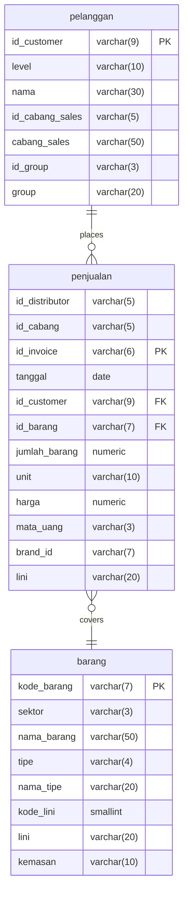
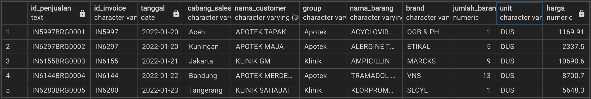
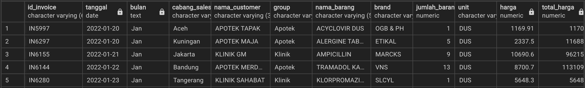
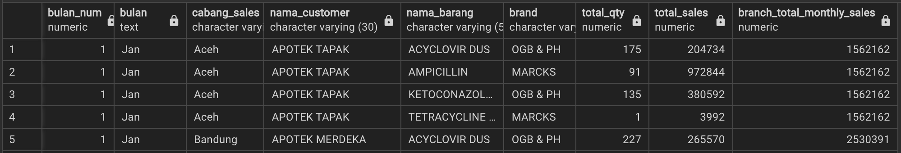
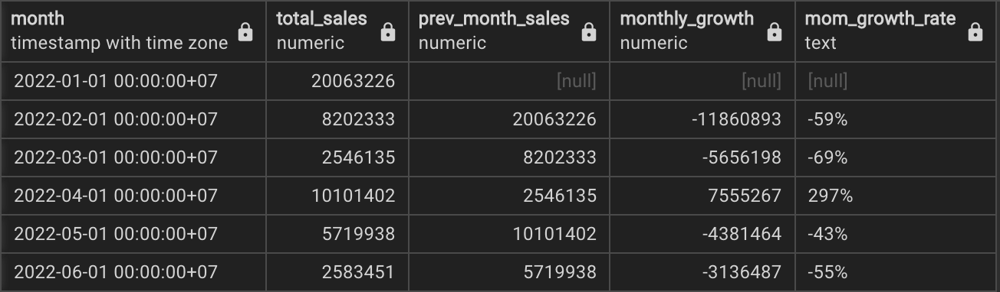
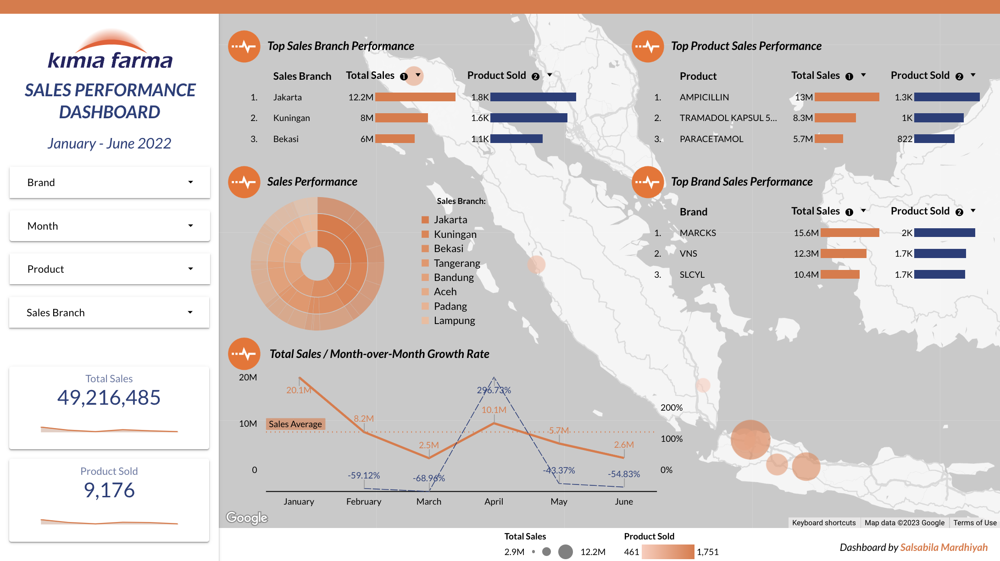

# Sales Performance Dashboard
Tools: <br>
👩🏻‍💻 Visual Studio Code <br>
👩🏻‍💻 PostgreSQL <br>
🗂️ GitHub <br>
📊 Google Looker Studio

## Project Background 
Kimia Farma is the first pharmaceutical industry company in Indonesia which was founded by the Dutch East Indies Government in 1817. As a Big Data Analyst Intern who already understands the sales data for each Brand at Kimia Farma, I was asked to make a dashboard of sales data in one year from the raw data that has been provided. To test my understanding, it is necessary to process the data from beginning to end.

## Task 01 : Data Preparation
Before starting data processing, the first step that must be done is to prepare raw data into structured data and ready to be processed. Here's what I do at Data Preparation Stage:

1. Download datasets given
2. Create a new database and tables for the prepared datasets by adjusting the data type of each column, also arranging Primary Keys and Foreign Keys for each table
3. Importing csv data into the database
4. Create entity relationships between tables based on the structure in the "Data Relationship"

<details>
  <summary>SQL Query</summary>
  
  ```sql
  -- Data Preparation --
-- Create new schema -- 
CREATE SCHEMA IF NOT EXISTS data;

-- Create table from dataset --
CREATE TABLE IF NOT EXISTS data.barang
(
	kode_barang varchar(7) PRIMARY KEY,
	sektor varchar(3),
	nama_barang varchar(50),
	tipe varchar(4),
	nama_tipe varchar(20),
	kode_lini smallint,
	lini varchar(20),
	kemasan varchar(10)
);
CREATE TABLE IF NOT EXISTS data.pelanggan
(
	id_customer varchar(9),
	"level" varchar(10),
	nama varchar(30),
	id_cabang_sales varchar(5),
	cabang_sales varchar(50),
	id_group varchar(3),
	"group" varchar(20)
);

CREATE TABLE IF NOT EXISTS data.penjualan 
(
	id_distributor varchar(5),
	id_cabang varchar(5),
	id_invoice varchar(6) PRIMARY KEY,
	tanggal date,
	id_customer varchar(9) references pelanggan(id_customer),
	id_barang varchar(7) references barang(kode_barang),
	jumlah_barang numeric,
	unit varchar(10),
	harga numeric,
	mata_uang varchar(3),
	brand_id varchar(7),
	lini varchar(20)
);

-- Change Date Style --
ALTER DATABASE kimia_farma
    SET "DateStyle" TO 'ISO, DMY';
  ```
</details>
<br>

Below is entity relationship diagram created based on interpretation available raw tables:


<p align="center">
Fig.1. Entity Relationship Diagram
</p>

## Task 02 : Datamart Design
Before designing sales dashboard, I will create datamart from previously made raw data, consisting of base and aggregate tables using PostgreSQL.

<details>
  <summary>SQL Query</summary>
  
  ```sql
-- Create Base Table --
CREATE TABLE data.base_table AS 
	SELECT 
		pj.id_invoice,
		pj.tanggal,
		pl.cabang_sales,
		pl.nama nama_customer,
		pl.group,
		b.nama_barang,
		b.lini brand,
		pj.jumlah_barang,
		pj.unit,
		pj.harga
	FROM
		data.penjualan pj
		JOIN data.pelanggan pl
			ON pl.id_customer = pj.id_customer
		JOIN data.barang b
			ON pj.id_barang = b.kode_barang
;

-- Create Aggregate Table --
CREATE TABLE data.aggregate_table AS
	SELECT
		id_invoice,
		tanggal,
		TO_CHAR(tanggal, 'Mon') bulan, ---Extract month name from date
		cabang_sales,
		nama_customer,
		"group",
		nama_barang,
		brand,
		jumlah_barang,
		unit,
		harga,
		ROUND(jumlah_barang * harga) total_harga ---calculate and round total price
	FROM
		data.base_table
;

-- Create Aggregate Table 2: Monthly Sales Summary --
CREATE TABLE data.monthly_sales AS
	SELECT
		EXTRACT(MONTH FROM tanggal) bulan_num,
		bulan,
		cabang_sales,
		nama_customer,
		nama_barang,
		brand,
		SUM(jumlah_barang) total_qty,
		SUM(total_harga) total_sales,
		SUM(SUM(total_harga)) OVER(PARTITION BY bulan, cabang_sales) branch_total_monthly_sales
	FROM
		data.aggregate_table
	GROUP BY
		1,2, 3, 4, 5, 6
	ORDER BY
		1,3,5
;

-- Create Aggregate Table 3: Month-over-Month Sales Performance --
CREATE TABLE data.mom_growth_rate AS
	SELECT
		DATE_TRUNC('month', tanggal) AS month,
		SUM(total_harga) AS total_sales,
		LAG(SUM(total_harga)) OVER (ORDER BY DATE_TRUNC('month', tanggal)) AS prev_month_sales,
		(SUM(total_harga) - LAG(SUM(total_harga)) OVER (ORDER BY DATE_TRUNC('month', tanggal))) AS monthly_growth,
		CAST(ROUND((SUM(total_harga) - LAG(SUM(total_harga)) OVER (ORDER BY DATE_TRUNC('month', tanggal))) 
			/ LAG(SUM(total_harga)) OVER (ORDER BY DATE_TRUNC('month', tanggal)) * 100) AS text)
			||'%' AS mom_growth_rate
	FROM
	  data.aggregate_table
	GROUP BY
	  1
	ORDER BY
	  DATE_TRUNC('month', tanggal)
;
  ```
</details>

<p align="center">
  <kbd> </kbd> <br>
  Fig.2. Base Table
</p>

<p align="center">
  <kbd> </kbd> <br>
  Fig.3. Aggregate Table 1
</p>

<p align="center">
  <kbd> </kbd> <br>
  Fig.4. Aggregate Table 2 (Monthly Sales Summary)
</p>

<p align="center">
  <kbd> </kbd> <br>
  Fig.5. Aggregate Table 3 (Month-over-Month Sales Performance)
</p>

## Task 03 : Dashboard Design
After designing Datamart from raw data, I built Sales Performance Dashboard based on the aggregate tables previously created. For Interactive Dasboard please click  <a href="https://lookerstudio.google.com/reporting/3987b2f4-1076-4d35-84dc-708d8ee7b846">this link</a>

<p align="center">
  <kbd> </kbd> <br>
  Fig.6. <a href="https://lookerstudio.google.com/reporting/3987b2f4-1076-4d35-84dc-708d8ee7b846">Kimia Farma Sales Performance Dashboard</a>
</p>

From the dashboard, some insights can be seen as follows:
- There is a significant overall sales performance increase on April, especially on Kuningan, Bekasi, Padang and Bandung sales branch which growth rate increased by >200%
- Almost 70% sales on April consist of ampicillin, tramadol, and ambroxol product sales which are popular cough and cold medicines also antibiotic
- An explanation that can be developed is that April is the time of transition from the rainy season to the dry season in Indonesia, causing erratic air conditions, lots of strong winds and the emergence of several diseases including coughs and colds.
<br>

Insights above also can be converted into marketing strategies as below:
- Launch a targeted health promotion campaign that focuses on the transition from rainy season to dry season. Highlight the increased need for cough and cold medicines during this period and position your products, especially ampicillin and ambroxol, as essential for maintaining health during changing weather conditions.
- Since there was a significant increase in sales in particular branches, run localized promotions tailored to each branch's audience. Offer branch-specific discounts or incentives to encourage repeat business from customers in those areas.
<br>

Source:
- https://www.kompas.com/skola/read/2022/08/12/070000269/pembagian-musim-di-indonesia